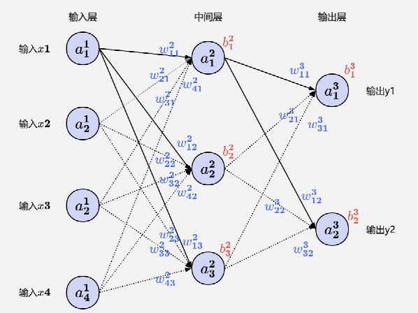

# LoRA微调QWen2.5-0.5B实践

## 前言

&emsp;&emsp;随着Qwen等大模型的开源，基于通用大模型进行场景化领域微调的门槛显著降低。这一趋势使得大模型在传统开发项目中的落地应用变得更加便捷，同时能大幅提升项目能力、简化开发流程，并使原本难以实现的业务逻辑成为可能。
&emsp;&emsp;本文将以​​"根据精简地址补齐完整五级行政区"​​这一具体场景为例，详细介绍如何基于​​Qwen2-0.5B​​大模型进行微调，使其在地址补齐任务上达到15B甚至32B大模型的水平。

## 基本概念
&emsp;&emsp;本章节将介绍神经网络、大模型精调、LoRA及LoRA模型合并等基本概念，帮助您理解微调的原理与训练过程的本质。  
&emsp;&emsp;**不过即使不熟悉这些概念，你也能正常完成模型微调。**因为当前主流开源基座模型（如: QWen、DeepSeek）结构设计成熟，微调流程高度自动化，实际操作中，微调仅需调整少量超参数（如：学习率、批次大小等），且这些参数通常提供经过验证的默认值，使得用户通常只需关注训练数据的质量与合理性即可。  

### 1.神经网络  
&emsp;&emsp;神经网络是一种受生物神经元启发的计算模型，其核心理论是通过可学习的权重参数和多层非线性变换，从输入数据中逐层提取特征，最终逼近复杂的输入-输出映射关系。如图：

<div style="text-align: center;">
  
  <figcaption style="font-style: italic; margin-top: 8px;">图1：神经网络示意图</figcaption>
  <br/>
</div>

&emsp;&emsp;神经网络由分层连接的神经元构成，每个神经元先计算输入的线性加权和（z = Wx + b），再通过激活函数（如ReLU/Sigmoid）引入非线性生成输出。通过分层结构使不同层级专注特定处理（例如嵌入层将文本映射为向量），通过逐步抽象数据实现复杂任务。日常我们所说的模型参数量（如：32B/64B）指的就是权重(W)和偏置(b)的总数，参数量越大，模型信息容量越高。

### 2.大模型精调
&emsp;&emsp;大模型精调（Supervised Fine-Tuning，SFT）作为大语言模型（LLM）的重要一环，其主要目标是使模型能够遵循指令输出预期回答，有效提升通用模型在特定的领域和应用场景的效果，更好的满足大模型的个性化应用，是一种用于改进和定制预训练大语言模型的方法。说白话就是：​​通过调整模型参数，让模型在一定容量（如：0.5B）下优先学习训练领域的知识，同时弱化对通用领域知识的依赖，从而使模型在训练领域能够达到同等容量通用模型所无法满足的效果。通常大模型的精调方法主要包括以下三类：

<div style="text-align: center;">
  
  <figcaption style="font-style: italic; margin-top: 8px;">图2：大模型精调</figcaption>
  <br/>
</div>

- **全参精调：**  
会更新模型所有参数，适合数据充足且计算资源丰富的场景，但成本高昂。这是因为大模型通常采用的梯度下降算法优化参数时，每一步训练都需要根据损失函数计算每个参数的梯度（偏导数），以确定调整方向和幅度。参数量越多，求偏导的计算量就呈线性增长，导致训练开销急剧上升；
- **LoRA精调：**  
LoRA（低秩适应）通过在通用大模型的关键层（如：自注意力层）旁注入低秩适配矩阵，冻结原始参数，仅微调新增的小规模参数。这种方法显著降低了计算开销，因为领域适配通常不需要重构所有功能层（例如：QWen等模型仅需调整自注意力层的Q、V层即可满足多数场景需求）；而且并不是所有的训练调整都是正向的，有可能由于不当的训练数据、不合适的参数设置，导致模型致模型原有能力退化，反而降低整体表现；
- **QLoRA​​精调：**  
进一步量化LoRA中的权重为4-bit（如结合NF4量化【量化是指将模型原有的32位浮点参数转换为低位宽（如4位整数）表示，通过**降低参数精度**来减少存储占用和计算开销】），显著减少显存占用，使得大模型精调可在消费级GPU上运行。

### 3.LoRA简介
&emsp;&emsp;模型微调其实就是不断调整参数，把原始参数矩阵W变成新矩阵W'（W'=W+ΔW）的过程。LoRA的本质在于：它把原参数W锁住不动，只让ΔW这个调整量发挥作用，而且把ΔW拆成两个小矩阵B和A的乘积（即：ΔW=BA，因为根据LoRA的研究，模型参数的变化通常集中在少数维度的关键特征上，通过低秩分解可以只关注这些少量关键维度特征）。通过低秩分解可以大幅减少训练参数量（例如，当 r=8 时，参数量可降至全微调的0.1%以下），极大的提升训练效率。如图所示为LoRA的过程分解：

<div style="text-align: center;">
  
  <figcaption style="font-style: italic; margin-top: 8px;">图3：LoRA低秩矩阵分解</figcaption>
  <br/>
</div>

### 4.模型合并
&emsp;&emsp;在上一章我们了解到，LoRA训练完成后得到的是增量矩阵ΔW=BA。在实际使用时，需要将这个增量矩阵合并到原始权重矩阵W中，才能得到最终所需的新模型W'=W+ΔW。这种合并操作有两种实现方式：
- **运行时动态合并：**在每次模型前向计算时，实时计算W' = W + BA，这种方式灵活，可以随时切换不同任务的LoRA适配器，但会增加少量计算开销；
- **训练完静态合并：**在训练结束后直接将W和BA相加得到新的权重矩阵W' = W + BA，然后保存合并后的完整模型。这种方式推理时没有额外计算，适合部署场景，但会失去LoRA的模块化特性。

<div style="text-align: center;">
  
  <figcaption style="font-style: italic; margin-top: 8px;">图4：LoRA适配器合并</figcaption>
  <br/>
</div>

## 模型微调
### 1.开发环境：
**基础框架：**PaddlePaddle(GPU版)  
```shell
pip install paddlepaddle-gpu -U -f https://www.paddlepaddle.org.cn/whl/linux/mkl/avx/stable.html
```  
**工具库：**PaddleNLP(develop分支)  
```shell
git clone https://github.com/PaddlePaddle/PaddleNLP.git
```  
**基础模型：**Qwen2.5-0.5B-Instruct
### 2.数据准备：
&emsp;&emsp;训练数据基础集使用“百度AI平台”公开数据集“[邮寄地址_数据集-飞桨AI Studio星河社区](https://aistudio.baidu.com/datasetdetail/127884)”；对数据集按比例拆分为：训练集(train.json->70%)、验证集(dev.json->15%)、测试集(test.json->15%)三个文件。数据集统一格式为：
```json
说明：
  src： str, List(str), 模型的输入指令、提示。
  tgt： str, List(str), 模型的输出。
示例：
 {"src":"补齐五级行政地址: 碑林区扬子江南路467-6号","tgt":"陕西省西安市碑林区扬子江南路467-6号"}
```  
### 3.开始训练
准备配置文件lora_argument_0p5b.json，参数如下：
```json
{
    "model_name_or_path": "Qwen/Qwen2.5-0.5B-Instruct",
    "dataset_name_or_path": "../data",                    #数据目录
    "output_dir": "../checkpoints/lora_ckpts",            #模型输出目录
    "per_device_train_batch_size": 2,
    "gradient_accumulation_steps": 8,
    "per_device_eval_batch_size": 2,
    "eval_accumulation_steps": 32,
    "num_train_epochs": 3,
    "learning_rate": 3e-04,
    "warmup_steps": 30,
    "logging_steps": 1,
    "evaluation_strategy": "epoch",
    "save_strategy": "epoch",
    "src_length": 1024,
    "max_length": 2048,
    "fp16": true,
    "fp16_opt_level": "O2",
    "do_train": true,
    "do_eval": true,
    "disable_tqdm": true,
    "load_best_model_at_end": true,
    "eval_with_do_generation": false,
    "metric_for_best_model": "accuracy",
    "recompute": true,
    "save_total_limit": 1,
    "tensor_parallel_degree": 1,
    "pipeline_parallel_degree": 1,
    "lora": true,
    "unified_checkpoint": true,
    "zero_padding": false,
    "use_flash_attention": false,
    "pissa": false
  }
```  
开始训练，命令如下：
```shell
python code/PaddleNLP/llm/run_finetune.py ./config/lora_argument_0p5b.json
```
### 4.模型合并（可选）
```shell
python code/PaddleNLP/llm/tools/merge_lora_params.py --model_name_or_path Qwen/Qwen2.5-0.5B-Instruct ./checkpoints/lora_ckpts
--output_path ./checkpoints/lora_merge --device "gpu" --safe_serialization True
```

### 5.结果验证
```json
from paddlenlp.transformers import AutoModelForCausalLM, AutoTokenizer
import paddle

## 设置设备（GPU/CPU）
paddle.set_device("gpu")  ## 或 "cpu"

## 加载模型和分词器
model_name = "Qwen/Qwen2.5-0.5B-Instruct"  ## 或 "qwen-14b" 等
tokenizer = AutoTokenizer.from_pretrained(model_name, use_fast=False)
base_model = AutoModelForCausalLM.from_pretrained(
    model_name,
    dtype="float16",  ## FP16 加速（需GPU支持）
    low_cpu_mem_usage=True  ## 减少CPU内存占用
)

## 提问的问题
input_text = "精简输出，补齐五级行政地址:  扶风法门镇法门寺"
messages = [
    {"role": "user", "content": input_text},
]
text = tokenizer.apply_chat_template(
    messages,
    tokenize=False,
    add_generation_prompt=True,
)
inputs = tokenizer(text, return_tensors="pd")

## 加载LoRA适配器
from paddlenlp.peft import LoRAModel
model = LoRAModel.from_pretrained(model=base_model, lora_path="./checkpoints/lora_ckpts")

## 生成响应
generated_ids = model.generate(
    **inputs,
    max_new_tokens=100,
    decode_strategy="greedy_search"  ## 或 "sampling"
)

## 解码模型输出
response = tokenizer.batch_decode(generated_ids[0])

print("模型回复:", response)
```
新老模型结果输出对比示例：

<div style="text-align: center;">
  
  <figcaption style="font-style: italic; margin-top: 8px;">图5：模型输出对比</figcaption>
  <br/>
</div>

### 三、改进优化
&emsp;&emsp;虽然通过以上微调优化，QWen2.5-0.5B模型在地址补全场景中已达到可用水平，但仍存在以下改进空间：
- **性能优化：**  
当前0.5B规模的模型虽可在CPU上运行，但可通过进一步量化（如4-bit或8-bit量化）降低计算开销，从而提升推理速度，缩短响应时间；
- **错别字优化​​：**  
当前模型在输入地址含错别字时表现欠佳。可采取分阶段训练策略优化：a) 错别字修正训练​​：针对q_proj进行错别字纠正训练，提升模型对输入错误的鲁性;         ​​ b) 地址补全训练​​：在错别字修正模型基础上，对v_proj进行补全训练，使模型能够同时处理纠错与补全任务，实现更完整的地址补全功能。  

### 四、总结
&emsp;&emsp;以上就是基于LoRA对QWen2.5-0.5B模型进行微调的完整实践过程。虽然本次实验以地址补全这一相对简单的场景为例，但其中涉及的微调方法、性能优化思路以及问题解决策略具有普适性，可以无缝拓展到其他任务场景。
